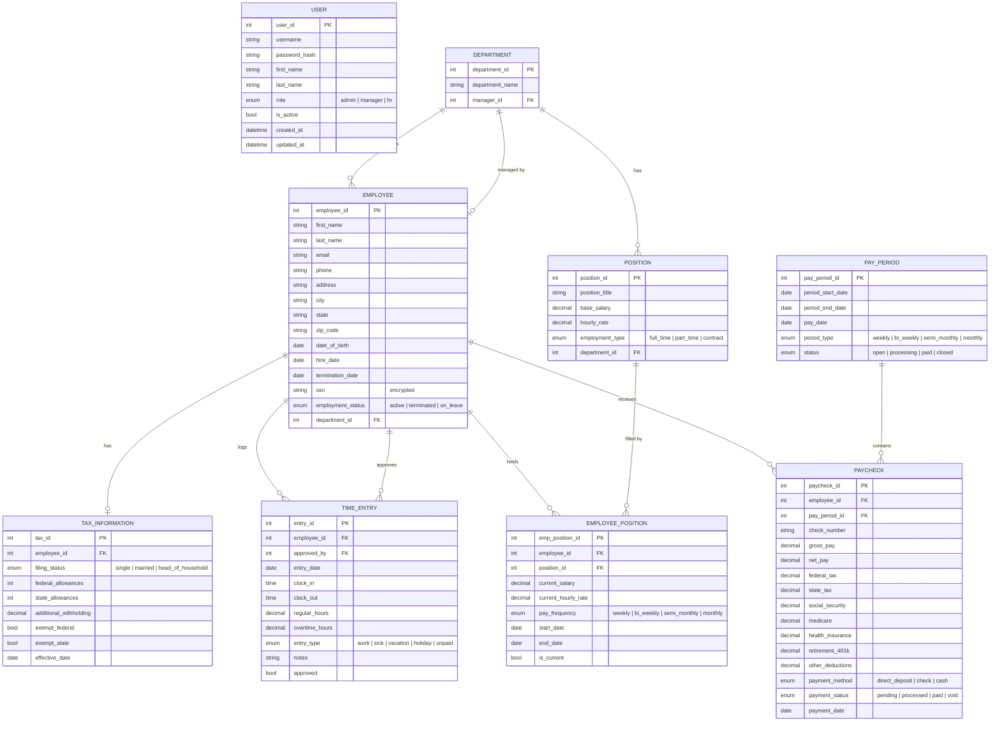
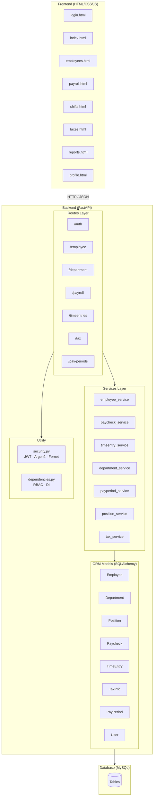
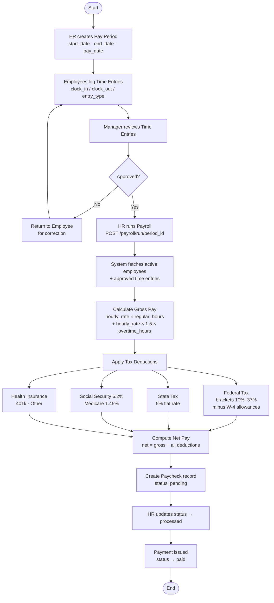
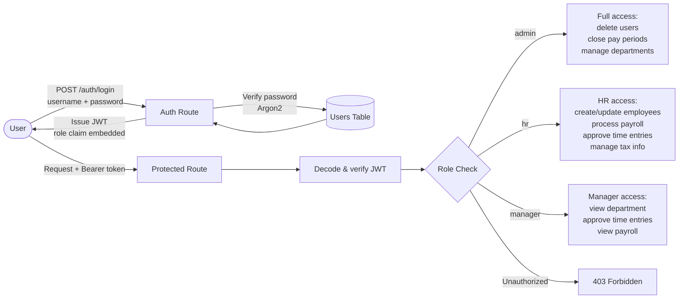
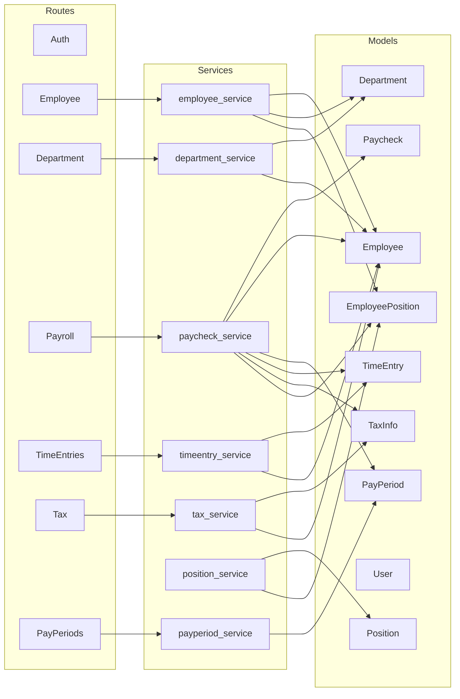

# Pay Central — System Diagrams

---

## 1. Entity Relationship Diagram (ERD)

---

## 2. System Architecture

---

## 3. Payroll Processing Flow

---

## 4. Authentication & Role-Based Access Control

---

## 5. Component Dependency Map

