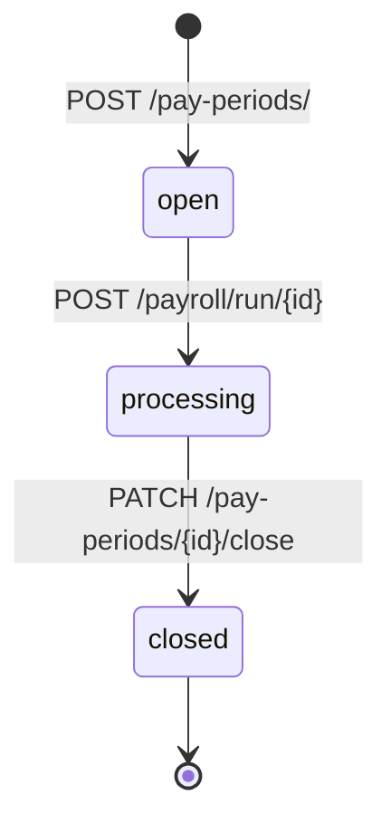
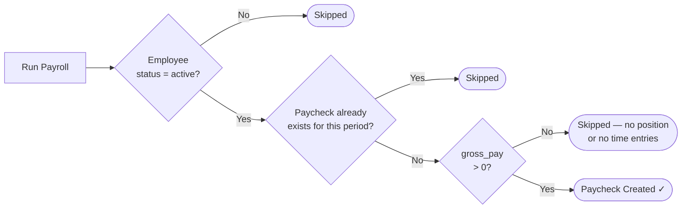

# Pay Central — Payroll Workflow

## Full Flowchart

```mermaid
flowchart TD
    A([Start]) --> B[Login\nPOST /auth/login]
    B --> C{Employee\nexists?}

    C -- No --> D[Create Employee\nPOST /employee/sign_up]
    C -- Yes --> E{Has position\nwith pay rate?}
    D --> E

    E -- No --> F[Insert into\nemployee_positions table\nvia DB tool]
    E -- Yes --> G{Time entries\nlogged?}
    F --> G

    G -- No --> H[Log Time Entry\nPOST /timeentries/create\nper workday]
    G -- Yes --> I[Create Pay Period\nPOST /pay-periods/]
    H --> I

    I --> J{Preview\npaycheck?}

    J -- Yes --> K[Preview Calculation\nGET /payroll/calculate\n/{employee_id}/{pay_period_id}]
    J -- No --> L[Run Payroll\nPOST /payroll/run/{pay_period_id}]
    K --> L

    L --> M{Paychecks\ncreated?}

    M -- No paychecks\ngross_pay = 0 --> N[Check position\nhas hourly rate or salary\nand time entries exist]
    N --> H

    M -- Yes --> O[View Paychecks\nGET /payroll/period/{pay_period_id}]

    O --> P[Close Pay Period\nPATCH /pay-periods/{id}/close\nAdmin only]

    P --> Z([Done])
```

---

## Step-by-Step API Reference

| Step | Method | Endpoint | Role Required |
|------|--------|----------|---------------|
| 1 | POST | `/auth/login` | Anyone |
| 2 | POST | `/employee/sign_up` | Admin, HR |
| 3 | — | Insert into `employee_positions` via DB | DB access |
| 4 | POST | `/timeentries/create` | Admin, Manager |
| 5 | POST | `/pay-periods/` | Admin, Manager |
| 6 | GET | `/payroll/calculate/{emp_id}/{period_id}` | Admin, Manager |
| 7 | POST | `/payroll/run/{pay_period_id}` | Admin, Manager |
| 8 | GET | `/payroll/period/{pay_period_id}` | Admin, Manager, HR |
| 9 | PATCH | `/pay-periods/{id}/close` | Admin only |

---

## Pay Period Status Lifecycle



---

## Why an Employee Gets Skipped During Run Payroll



---

## Gross Pay Calculation Logic

```
If employee has hourly rate:
    gross_pay = (regular_hours × rate) + (overtime_hours × rate × 1.5)

If employee has salary:
    gross_pay = annual_salary ÷ pay_frequency_divisor
        weekly       → ÷ 52
        bi_weekly    → ÷ 26
        semi_monthly → ÷ 24
        monthly      → ÷ 12
```

## Tax Deduction Breakdown

```
Federal Tax   → 2024 bracket table (adjusted by allowances)
State Tax     → 5% flat
Social Sec.   → 6.2%
Medicare      → 1.45%
─────────────────────────
Net Pay = Gross Pay − (Federal + State + Social Security + Medicare)
```
